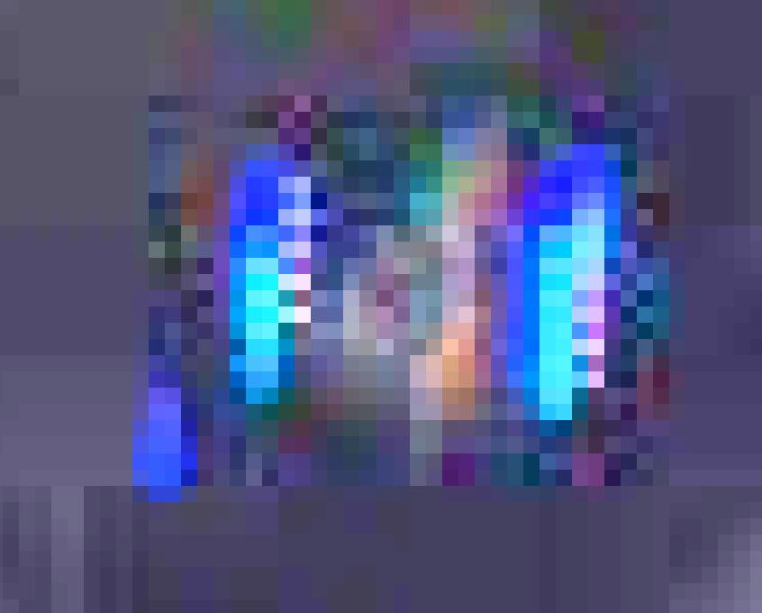
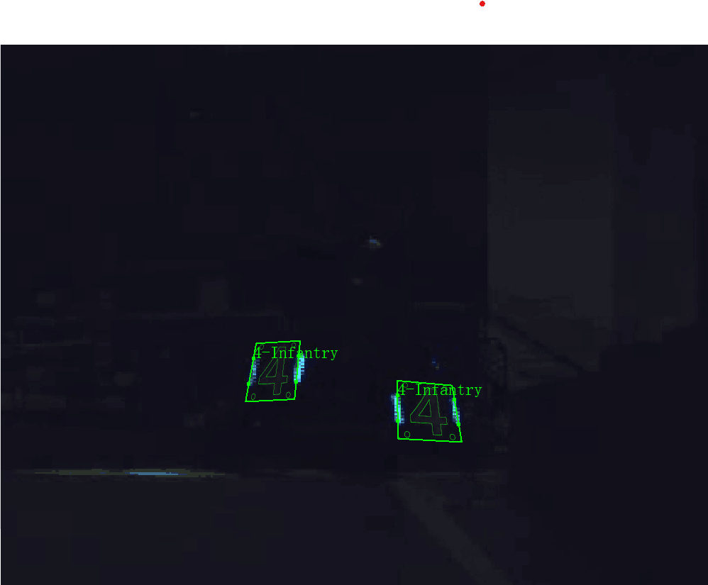

<div style="background-color: #ffcccc; border: 2px solid red; padding: 10px; margin-bottom: 20px;">
  <h2 style="color: red; text-align: center;">⚠️ 警告 ⚠️</h2>
  <p style="color: red; font-weight: bold; text-align: center;">请在操作之前仔细阅读整篇文章！</p>
</div>

<div align="center">
  <h1 style="font-size: 2.7em;">LabelMaster指南 v1.0</h1>
</div>

<div align="right">
  <p style="font-size: 1.3em;">Helios</p>
</div>

根据这个里面添加了一些逻辑比如
1.修改原本的ui为可变化范围并且最大化label画布用于帮助更好的确认角点，修改了防止缩放比例错误造成的图片远离屏幕有。
2.按下d修改类别默认为按下enter删除，如果切换了颜色或者类型默认enter保存，
3.增加了撤回逻辑（防止对标点完成后的不小心按下space导致浪费精力。但是栈有限，撤回步数不多）
4.动缩放用于精准标注（目前暂时用于w按键s案件暂时不缩放）
5.在原来使用sjtu的模型上进行了传统视觉以辅助修正类别和颜色。对于自定义添加目标则按下v可用于传统视觉标注类别颜色辅助
6.添加了选择模型以适配推理helios2024视觉部分detectornode代码用于帮助最后人工辅助查看模型精度。
7.按下c可隐藏由svg变换填充导致的无法识别
8.修改了所有有关焦点选择的逻辑使得更人性化
9....还有好多有点忘记了当作彩蛋算了


种种目标是为了提高标注的效率，通过修改的软件笔者曾经一个小时标注了600张图。


### 常用
O：打开数据集文件夹

右键：拖动图像

鼠标滚轮：缩放图像

鼠标中键/右键：平移选中的目标

A：添加目标

Ctrl + S：保存

D:修改类别快捷键到想要修改来的类别才可以

space：方法对当前图片进行自动标注

ctrl+z: 撤回刚才的标点操作（包括但不限于对标点完成后的不小心按下space, 仅限于同一张图片中，切换图片将销毁）

Q：切换上一张图片

E：切换下一张图片

W：切换上一个目标

S：切换下一个目标

C: 隐藏绿线

T：提高图片亮度
> - 若文件路径含有中文则无法使用此功能
> - 图像增强模式之间相互冲突，开启一个模式会默认关闭其它模式

R：直方图均衡化
> 若文件路径含有中文则无法使用此功能

Delete：删除当前目标

2：将当前图片移出当前数据集
> - 可在回收站找到

### 辅助
I：插值
> 使用方法
> - 第一次点击时自动跳转到待插值图片的上一张图片，此时需要在目标区选中插值的第一个目标
> - 第二次点击时自动跳转到待插值图片的下一张图片，此时需要在目标区选中插值的第二个目标
> - 第三次点击时自动跳转到待插值图片并生成插值结果
> 
> 注意
> - 插值结果只能作为辅助标注，不能作为最终结果，还需要微调
> - 选中的插值目标类别需要保持一致

G：锚点平行矫正
> 以当前选中的点与逆时针方向的相邻点所组成的直线为基准，过逆时针方向的相邻点作其平行线，若基准直线的水平夹角较小（也即选中的点为2号或4号关键点）则改变选中点对角点的X坐标（其它两个点则改变y坐标）使得该点位于所作平行线上

F：定点平行矫正模式
> 锚点平行矫正的特殊模式，默认选中1号点固定为选中点，当除3号点以外的其它点坐标改变时执行平行矫正。即3号点只能在过4号点的与1号点与2号点组成的直线的平行线上运动，其它点可以任意移动。
> - 该按键为模式切换键，第一次点击持续生效，再次点击可以取消
> - 矫正功能之间相互冲突，使用一个功能会默认关闭其它矫正模式

H：锚点平行四边形矫正
> 改变选中点对角线方向上的点使得四个点形成平行四边形

X：锚点平行四边形模式
> 固定当前选中的点为选中点，当除选中点对角点以外的其它点坐标改变时执行平行四边形矫正

Z：定点平行四边形模式
> 默认固定1号关键点为选中点，当除选中点对角点以外的其它点坐标改变时执行平行四边形矫正


# 目录
- [目录](#目录)
- [更新日志](#更新日志)
  - [v1.0](#v10)
    - [LabelMaster 1.3.6 更新日志](#labelmaster-136-更新日志)
- [前记](#前记)
- [- 装甲板数据集标注 -](#--装甲板数据集标注--)
- [标注要求](#标注要求)
  - [目标要求](#目标要求)
  - [标注要点](#标注要点)
- [示例](#示例)
  - [演示图像](#演示图像)
    - [可见](#可见)
  - [标准目标](#标准目标)
    - [可见](#可见-1)
    - [标注要点](#标注要点-1)
  - [拖影目标](#拖影目标)
    - [标注要点](#标注要点-2)
    - [补充说明](#补充说明)
  - [小目标](#小目标)
    - [可见](#可见-2)
    - [标注要点](#标注要点-3)
  - [色块丢失](#色块丢失)
    - [可见](#可见-3)
    - [标注要点](#标注要点-4)
    - [标注示例](#标注示例)
  - [侧对目标-空间位置关系](#侧对目标-空间位置关系)
    - [可见](#可见-4)
  - [蓝色与紫色的区分](#蓝色与紫色的区分)
    - [可见](#可见-5)
  - [反例锦集](#反例锦集)
    - [图片要求反例](#图片要求反例)
    - [暗影行者](#暗影行者)
    - [香蕉线](#香蕉线)
    - [特例独行](#特例独行)
    - [左右颠倒](#左右颠倒)
  - [补充说明](#补充说明-1)
    - [拖影补充说明](#拖影补充说明)
- [- LabelMaster与数据集标注 -](#--labelmaster与数据集标注--)
- [LabelMaster使用指南](#labelmaster使用指南)
  - [界面介绍](#界面介绍)
  - [基本操作](#基本操作)
  - [快捷键及功能按键介绍](#快捷键及功能按键介绍)
  - [Linux下编译指南](#linux下编译指南)
    - [**更优雅的QT安装**](#更优雅的qt安装)
    - [**QT安装**](#qt安装)
    - [**opencv安装**](#opencv安装)
    - [**其它依赖库安装**](#其它依赖库安装)
    - [**下载源码编译**](#下载源码编译)
- [Q\&A](#qa)
  - [重要](#重要)
  - [了解](#了解)
- [- 开发者手册 -](#--开发者手册--)
- [标签格式](#标签格式)
- [程序接口](#程序接口)
- [用户配置介绍](#用户配置介绍)
- [自定义标注介绍](#自定义标注介绍)
- [附录](#附录)
  - [装甲板贴纸](#装甲板贴纸)
  - [矿石介绍](#矿石介绍)

# 更新日志
## v1.0
> 适配**LabelMaster 1.3.6**

Written by hh，2023/8/12

### LabelMaster 1.3.6 更新日志
- 现在可以用一个程序标注所有数据集了
  - 本工具提供装甲板、风车五点（无模板）、风车四点（风车装甲板）、工程（矿石、兑矿站）的标注支持
  - 可以在界面左上角选择相应标注模式或[预加载](#程序接口)
  - 选择错误的模式可能会导致数据读取有问题，请在选择正确的模式后打开数据集
- 现在新标注的装甲板会沿用上一个标注的装甲板的类
- 现在更改类时会显示当前待更改的类
- 现在打开LabelMaster时会以上一次选择的模式打开上一次打开的文件夹并定位至上一次标注的地方
- 提供了“自动提高图片亮度”的功能
  - 该选项的勾选会在下次打开时保留
- 提供了“设置”按钮
  - 可以自定义关键点吸附识别距离
  - 可以自定义亮度提高倍数
  - 设置的配置在下次打开时保留
- 为用户配置设置了版本限制，在使用版本不同的LabelMaster时配置无法加载
- 鸽了我不说你们肯定也不会想要的改变窗口大小的功能

# 前记
- 本工具在[上海交通大学RoboMaster智能数据集标注工具](https://github.com/xinyang-go/LabelRoboMaster)的基础上开发
- 本指南共分为三个主要部分
  - [装甲板数据集标注](#--装甲板数据集标注--)
    - 开源了我们队的装甲板数据集标注标准
    - 欢迎与我们进行数据集或内录的交换（QQ：513099046）
  - [LabelMaster与数据集标注](#--labelmaster与数据集标注--)
    - 介绍了用LabelMaster进行数据集标注的全流程与LabelMaster的使用方法
  - [开发者手册](#--开发者手册--)
    - 介绍了LabelMaster开发者迅速开发的指南
- 本指南亮点
  - 提供了[LabelMaster快捷键介绍](#快捷键及功能按键介绍)
  - 完善的文档超链接，文档关键词（一般为蓝色）可以点击直接跳转至相应位置
  - 提供了[Linux下编译指南](#linux下编译指南)

---
# <div align=middle><p style="font-size: 1.2em;">- 装甲板数据集标注 -</p><div align=left>

# 标注要求
> 数据集是整个视觉识别的基础所在，极大程度的决定了模型的质量，数据集标注必须精准，主要有以下几点要求
## 目标要求
- 图片中所有符合要求的目标应该全部标注（[反例](#图片要求反例)）
  - 装甲板被遮挡（包括超出图片边界）应当少于30%
  - 装甲板灯条至少有一条露出70%
  - 装甲板贴纸应肉眼容易识别
  - 装甲板表面平面与图片平面二面角应当小于$80\degree$
## 标注要点
- 白色（熄灭）、红色、蓝色、紫色的颜色类别与装甲板类型类别标注需完全正确
- 标签标注要点
  - 调整装甲板目标的四个关键点，使得**当图片放大使得整个装甲板占据整个标注区时，蒙版的绿色线条完全成为装甲板表面白色与黑色分界线**
  - 装甲板两侧凹槽与灯条最亮的部分**互相平行且长度近乎相等**
- 模板的四个圈不用管
# 示例
## 演示图像
> 这个图像在实际标注过程中不会出现，此处为了展示模板和装甲板可以完全契合贴纸。
### 可见
- 模板中间图案线条完全成为黑色与白色的分界线
- 模板外框（绿色）与贴纸完全契合
- 可移动的四点不在装甲板表面，位于贴纸两侧凹槽角点正上/正下方


## 标准目标
> 标准状况下的数据集标注示例，这个是大家主要碰到的情况
 
### 可见
- 装甲板边界与环境融为一体（所以标注时不用太在意）
### 标注要点
- **当图片放大使得整个装甲板占据整个标注区时，蒙版的绿色线条完全成为装甲板表面白色与黑色分界线**
- 两侧凹槽不一定与灯条最亮的部分契合，在其附近，但是**互相平行且长度基本相等**（由于色散，灯条会长一点）


## 拖影目标
> 拖影是指快门开启期间被摄物体高速移动，导致被摄物体在不同方位的光线被记录导致的现象

下图是严重拖影的示例，实际标注过程中不会遇到如此严重的情况
### 标注要点
- 满足标准目标标注要点
- 白色高亮部分基本位于图案线条框定的范围内
- 颜色较暗的拖影可以不位于框定范围内
### [补充说明](#拖影补充说明)


## 小目标
### 可见
- 放大后像素颗粒大
- 灯条更胖
### 标注要点
- 图案线条中线与模板线条中线重合


## 色块丢失
### 可见
- 1的左上角部分白色丢失
- 整个画面像素按块分布（成块地灰，成块地噪声）
### 标注要点
- 此时模板可以包含黑色部分

<div align=middle><div align=left>

### 标注示例
<div align=middle><div align=left>

## 侧对目标-空间位置关系
> 灯条与装甲板表面不在同一水平面上，在侧对时灯条的光会被装甲板表面遮挡；灯条为成块发光，在侧对时可见的发光面更大
### 可见
> 当左侧的灯条远离我们，右边的灯条靠近我们时
- 远离我们的一侧灯条被装甲板表面遮挡，灯条更窄；靠近我们的一侧灯条发光面更大，灯条更宽
- 当前装甲板表面朝向下，两侧关键点位置较该侧灯条最亮部分偏左
<div align=middle><div align=left>

## 蓝色与紫色的区分
> 蓝色的光强比红色大，因此紫色会比较像蓝色，较难区分
### 可见
- 紫色最亮的白色部分更多，灯条周围有明显的紫色存在
<div align=middle>

紫色装甲板


蓝色装甲板

<div align=left>

## 反例锦集
### [图片要求](#图片要求)反例
以下三组示例无需标注
> 装甲板被遮挡（包括超出图片边界）应当少于30%
<div a方法lign=middle><div align=left>

> 装甲板灯条至少有一条露出70%
<div align=middle><div align=left>

> 装甲板贴纸应肉眼容易识别
<div align=middle><div align=left>

> 噪点

<div align=middle><div align=left>

> 模糊


> 倾斜

<div align=middle><div align=left>


### 暗影行者
> 未开启图像增强模式标注
<div align=middle><div align=left>

### 香蕉线
> 两个灯条应该与对应侧灯条平行
<div align=middle><div align=left>

> 当一侧灯条缺失时该侧应与另一侧近乎平行
<div align=middle><div align=left>

### 特例独行
> 标注不完全
<div align=middle><div align=left>

### 左右颠倒
> 轴对称的图案左右标反了
- 可见在LabelMaster上label是显示在右上角，并非左上角
<div align=middle>
<div align=left>

## 补充说明
### 拖影补充说明
> 如何判断拖影

灯条真实位置位于灯条光圈最亮的部分（如图中红光最量呈黄色，蓝光最亮呈白色）（仅装甲板正对时），将关键点拖至灯条真实位置，此时可见仍有大量颜色较暗的白色部分无法框入其中，此时认为存在拖影。根据[示例](#拖影目标)，只需将最亮的部分框进去就好。


---
# <div align=middle><p style="font-size: 1.2em;">- LabelMaster与数据集标注 -</p><div align=left>

# LabelMaster使用指南
- 本指南适配的版本参见[更新日志](#更新日志)

## 界面介绍

*图片仅供参考，具体请以实物为准

## 基本操作
> 界面按键中有对应快捷键的按钮会在按钮末尾注明快捷键，按钮与其对应的快捷键作用相同
1. 按下A键添加新目标
> 在标注开始之前可以按下space（空格键）进行自动标注
>
> 在开始之前或自动标注之后要检查整张图片
> - 校对看见的目标数与目标区目标区目标数
>   - 是否有完全在图片外的目标
>   - 是否有重叠在一起的目标
> - 校对是否有类别标注错误的目标
2. 按序依次点击标注区创建装甲板（点可以越出图片）
   - 右键取消 
   - 为方便叙述，按序依次编号关键点为1,2,3,4号关键点
<div align=middle><div align=left>

3. 在目标区双击新创建的目标（一般为目标第一个）修改类别
> 目标类别由颜色与类型组成
> - 颜色为装甲板两侧灯条颜色
> - 目标区每个选项代表一个目标，其中文字代表类别，颜色代表颜色类别
> - 每个类别对应的装甲板图可在本手册[附录](#装甲板贴纸)查看
> 
> 删除目标
> - 在标注区或目标区选中目标按下delete键
> - 双击目标区目标，在弹出的界面中选择删除
4. 拖动四点使得模板标注满足标注要求
> - 在关键点（步骤二点击生成的四个点）及其附近长按拖动
> - 鼠标滚轮缩放图像
> - 右键拖动图像
> - 选中目标的关键点之一即为选中目标，模板显示为红色
> - 未选中的目标显示颜色类别对应颜色
> - 若图片过暗可以
>   - 按下T键提升图片亮度
>   - 按下R键对图片执行直方图均衡化
>   - 两种方法均能提高图片亮度，但是效果有所差别，实际标注过程中可以都试试。图片增强对原图不会造成影响。
>   - 图像增强模式之间相互冲突，开启一个模式会默认关闭其它模式
5. 重新执行第一步直到所有目标都被正确且准确标注
6. 检查是否有未标注的目标或错误标注的多余目标
7. 保存当前图片数据
> - 若在状态栏勾选自动保存则无需手动保存
>   - 自动保存仅在按下Q或E键切换图片时才会生效
> - 手动保存为Ctrl + S
8. 使用按键E切换下一张图片
> - 按键Q切换上一张图片
> - 点击图片区任意选项可以切换到对应图片，但是不会自动保存当前数据

## 快捷键及功能按键介绍
> 对目标进行的操作一定要在目标区选中对应目标


## Linux下编译指南
> 本指南使用 ubuntu20.04 + OpenCV 4.5.4 + QT 6.4.3 配置和使⽤该⼯具

### **更优雅的QT安装**
打开终端输入
```
sudo apt install qt5-default
sudo apt install libqt5svg5-dev
```
即可安装，该步骤无需修改CMakeLists.txt

### **QT安装**
1. 在[官网](https://d13lb3tujbc8s0.cloudfront.net/onlineinstallers/qt-unified-linux-x64-4.5.2-online.run)或[清华源](https://mirrors.tuna.tsinghua.edu.cn/qt/official_releases/online_installers/qt-unified-linux-x64-online.run)下载 QT 的在线安装包
2. 在下载⽬录下打开终端，隔⾏依次键⼊:
```s
chmod +x qt-unified-linux-x64-4.5.2-online.run
./qt-unified-linux-x64-4.5.2-online.run --mirror \
https://mirrors.tuna.tsinghua.edu.cn/qt  # 使用清华源安装
```
3. 在打开的安装窗⼝中⼀路按照提⽰安装 QT ，其中在安装文件夹中如下图选择：

在选择组件中仅选择Qt-Qt5.15.2-Desktop gcc 64-bit就好 


### **opencv安装**
请自行安装

### **其它依赖库安装**
QT的编译依赖 OpenGL 库，需⼿动安装，打开终端，键⼊:
```s
sudo apt install libgl1-mesa-dev
sudo apt install libglu1-mesa-dev freeglut3-dev
```
同时，编译需要 git cmake build-essential 等库，打开终端，键⼊:
```s
sudo apt install git vim cmake-qt-gui build-essential
```

### **下载源码编译**
1. 在合适的安装⽬录下(⽐如 ~)下打开终端，键⼊:
```s
git clone https://github.com/MonthMoonBird/LabelRoboMaster.git
```
2. 打开 CMakeLists.txt ， 模仿图中在第8行添加 Cmake 设置:
```s
set(CMAKE_PREFIX_PATH "你的QT安装⽬录/QT版本/gcc_64")
```

保存并关闭

3. 编译运行
- 配置

在源码目录下打开终端，键⼊
```s
mkdir build
cd build
cmake ..
```
出现如下提⽰说明配置成功

- 编译

在终端键⼊
```s
make
```
出现如下提⽰说明编译成功

- 运行

在终端键⼊
```s
./LabelRoboMaster
```
出现LabelMaster窗口说明安装成功

# Q&A
## 重要
Q：我发方法现我在Windows下打开LabelMaster时，程序字的字号过大导致有些内容看不见，怎么解决？
> 可以查看[微软对于该问题的解答](https://answers.microsoft.com/zh-hans/windows/forum/all/win10%E9%AB%98%E5%88%86%E8%BE%A8%E7%8E%87%E4%B8%8B/dd6e457c-2f77-4946-bc33-1a2d61549eb5)，选择合适的方法解决。
> 这里提供一种解决方法：右键可执行文件，选择属性-兼容性-更改高DPI设置-替代高DPI缩放行为-系统

Q：两个灯条是平行的，我在标注目标时可以一直开启平行四边形模式或定点平行矫正模式吗？
> 不可以。由于相机透视变换与相机畸变等因素影响，实际上目标两侧的关键点组成的直线并不平行。如果开启平行模式，在多次调整后往往会发现最终无法使得蒙版的绿色线条完全成为装甲板表面白色与黑色分界线

Q：我标注时并没有将目标放大到充满整个标注区，但是看上去我也使蒙版的绿色线条完全成为装甲板表面白色与黑色分界线了，小小的也很可爱嘛，可以吗？
> 不可以。网络输出关键点精度的上限取决于数据集标注的上限，特地强调将图片放大使得整个装甲板占据整个标注区就是为了看见更多的细节，提高标注的精度。每个人标注的量是固定的，如果没有按照标准标注会被要求返工重新标注。

Q：我发现我在运行LabelMaster时无法打字，是怎么回事？
> 由于LabelMaster支持快捷键，在测试过程中有发现程序会拦截键盘数据的问题，此时只要关闭LabelMaster即可。（目前还没有找到BUG在哪里发生的）

Q：数据集标注工具中有几个按钮是灰色的，我无法点击使用，是因为没有充VIP吗？
> ~~是的，V我50。~~ 若发现发行版数据集标注工具有部分按钮被禁用，是因为它们可能会对数据集造成破坏乃至严重后果，或者是正在测试的功能。

## 了解
Q：装甲板贴纸凹槽为什么不与图片中的灯条相契合呢？
> 因为灯条与装甲板表面平面不在同一平面上，在除了正对以外的视角观察时装甲板会遮挡较远的灯条，较近的灯条侧面发光造成发光面积增大，从而无法单纯从灯条判断关键点位置

---
# <div align=middle><p style="font-size: 1.2em;">- 开发者手册 -</p><div align=left>

# 标签格式
为了方便，LabelMaster的输出格式为：每一个图片对应同名txt文件为标签文件，标签文件中的每一行为一个目标，每行的格式如下：
```
[目标各点的x、y归一化坐标] <目标类id> <目标颜色id>
```
- 目标点的顺序和LabelMaster中的标注顺序一致
- 目标类id与LabelMaster中的标签顺序一致
- 装甲板标注目标ID见下表

| 贴纸         | ID     |
|--------------|-------|
| G（哨兵）     | 0     |
| 1（一号）     | 1     |
| 2（二号）     | 2     |
| 3（三号）     | 3     |
| 4（四号）     | 4     |
| 5（五号）     | 5     |
| O（前哨站）   | 6     |
| Bs（基地）    | 7     |
| Bb（基地大装甲） | 8     |
| L3（三号平衡）     | 9     |
| L4（四号平衡）     | 10     |
| L5（五号平衡）     | 11     |

- 颜色ID见下表

| 类别    | color |
|--------|-------|
| Blue   | 0 |
| Red    | 1 |
| N（熄灭）| 2 |
| Purple | 3 |

# 程序接口
- 程序在终端运行时可以传入两个参数
  - 第一个参数为字符串
    - 当路径为文件夹时打开的文件夹的路径
    - 当路径为文件时打开文件上级目录并定位到对应文件
      - 注意：图片与标签文件需在同一目录下
  - 第二个参数为数字，表示打开时的标注模式
    - 数字与模式的对应关系详见[drawonpic.h](drawonpic.h)第14行

# 用户配置介绍
- 用户配置的输入输出在configure文件中实现
  - class Configure在class Drawonpic中为公有子变量configure
  - 用户配置的保存在~Drawonpic函数中
- 用户配置的参数设置在configuredialog文件中实现
  - 可以在[configuredialog.ui](configuredialog.ui)的44行与47行设置点吸附距离的上下限
  - 可以在[configuredialog.ui](configuredialog.ui)的81行与84行设置亮度提高倍数的的上下限

# 自定义标注介绍
> 一种自定义模式只支持两种尺寸的模板变化矩阵
1. 设置自定义标注标识
   - 在[drawonpic.h](drawonpic.h)第14行的LabelMode中注明

2. 添加模式选项
   - 在[mainwindow.ui](mainwindow.ui)第364行后添加
```HTML
     <item>
      <property name="text">
       <string>自定义模式</string>
      </property>
     </item>
```

3. 添加对应目标的svg模板文件
   - 在(resource.qrc)[resource.qrc]第22行后添加
```
        <file>文件路径</file>
```

4. 设置svg模板加载配置
```C++
case Mode:
  // 向standard_tag_render中加载对应模板
  standard_tag_render[0].load(QString(":/pic/tags/文件路径"));
  // 设置四个点在svg中的坐标
  small_pts.clear();
  small_pts.append({19.377, 23.514});
  small_pts.append({1.967, 226.881});
  small_pts.append({242.859, 226.628});
  small_pts.append({225.282, 22.799});
  // 设置svg图像的大小
  small_svg_ploygen.clear();
  small_svg_ploygen.append({0., 0.});
  small_svg_ploygen.append({0., 250.});
  small_svg_ploygen.append({244.826, 250.});
  small_svg_ploygen.append({244.826, 0.});
  break;
```

5. 设置目标显示配置
   - 在[labeldialog.cpp](labeldialog.cpp)中的update_list_name函数中加载目标区的名字显示
   - 在[labeldialog.cpp](labeldialog.cpp)中的setup_boxes函数中设置类修改对话框的名字显示

# 附录
## 装甲板贴纸
  
<div align=middle>
哨兵 < 前哨站 > 工程
<div align=left>
  
<div align=middle>
3号步兵 < 4号步兵 > 5号步兵
<div align=left>
 
<div align=middle>
英雄 | 3号平衡
<div align=left>
 
<div align=middle>
4号平衡 | 5号平衡
<div align=left>
 
<div align=middle>
基地小装甲板 | 基地大装甲板
<div align=left>

## 矿石介绍
<div align=left>
  
<div align=middle>
矿顶 < 矿侧面（R标） > 矿底
